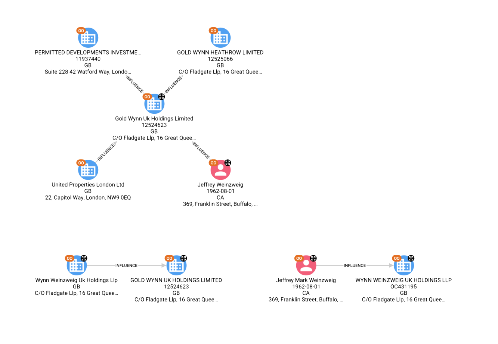
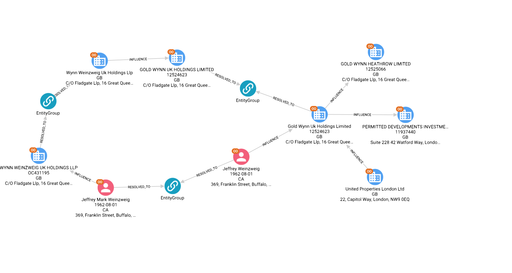
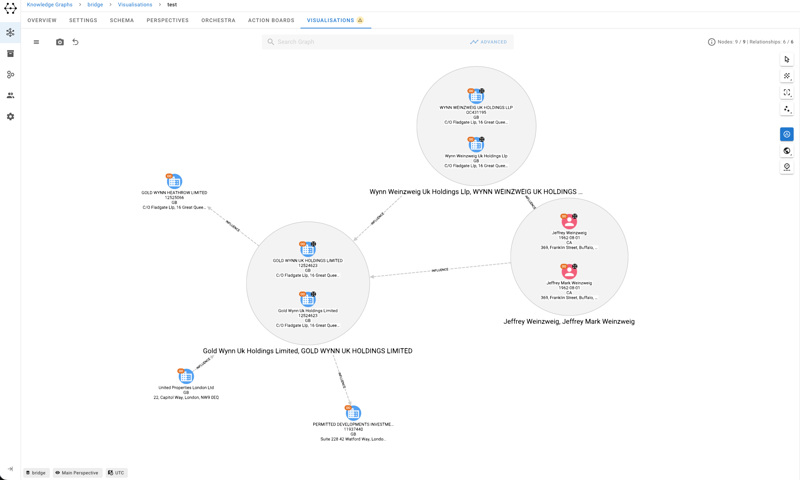
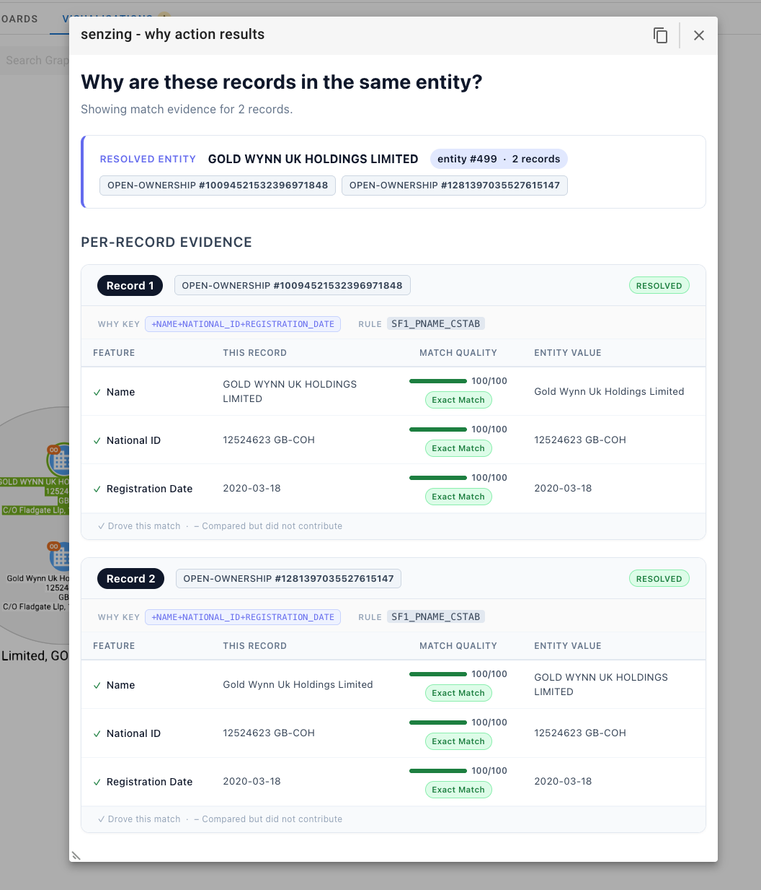

# Operationalising Entity Resolved Graphs

Workshop material for the **[GraphAware Bridge Meetup](https://graphaware.com)**, Prague — June 4th, 2026.

**Presenters**
- [Paco Nathan](https://github.com/ceteri) — Principal Developer Relations Engineer, [Senzing](https://senzing.com)
- [Christophe Willemsen](https://github.com/ikwattro) — CTO, [GraphAware](https://graphaware.com)

---

## What this workshop covers

A hands-on walkthrough of how to build, operate, and consume an entity-resolved graph in production — combining [Senzing](https://senzing.com)'s entity resolution engine with [Neo4j](https://neo4j.com) and [GraphAware Hume](https://graphaware.com). We cover the full operational arc: ingesting raw records, understanding how Senzing resolves (and separates) entities, keeping the graph live as records update, and surfacing explainability to end users through Hume.

The dataset used throughout is a subset of the [min_aml](references/min_aml.md) corpus: UK beneficial-ownership records (Open Ownership) cross-referenced with sanctioned entities (OpenSanctions).

---

## Repository structure

```
notes/            Speaker notes and section prose (primary content workspace)
  sections/       13 section .md files, one per workshop phase
  assets/         Data files, Mermaid diagrams, Senzing JSON snippets
  TODOS.md        Open questions and missing assets, owner-tagged

how/              Senzing WHY / HOW API examples
  explain_how.py  Convert a HOW response JSON → HTML report
  explain_why.py  Convert a WHY response JSON → HTML report

mappings/         Python mapping code: raw graph records → Senzing JSON
slides/           Marp slide deck — see slides/README.md for build instructions
references/       Data references and prior talks
screenshots/      Screenshots used in this README and slides
```

---

## Getting started

### Prerequisites

- Python 3.9+ (for `how/` and `mappings/` scripts)
- Node.js 18+ and npm (for `slides/`)
- A Senzing installation if you want to run the ER pipeline live

### Content (notes)

The `notes/sections/` directory is the primary workspace. Each file maps to one workshop phase. Start with `notes/sections/00-running-order.md` for the full agenda and per-section time budget.

Open questions and pending decisions are tracked in `notes/TODOS.md`, grouped by section and tagged by owner (Paco / Christophe / Joint).

### Senzing WHY / HOW reports

These scripts render Senzing API responses to self-contained HTML pages — useful for demos and slide prep.

```bash
# WHY report: why are these records in the same entity?
cd how
python explain_why.py senzing-why-response.json why-report.html

# HOW report: step-by-step resolution trace
python explain_how.py senzing-how-response.json how-report.html
```

### Record mappings

The `mappings/` scripts show how raw person and organisation records from a Hume graph are translated into Senzing's JSON input format.

```bash
# Inspect the base mapping template
cat mappings/mapping.py
```

### Slides

```bash
cd slides
npm install
make dev      # live preview at http://localhost:8080
make build    # export to slides/dist/
```

See `slides/README.md` for full instructions.

---

## Screenshots

### Graph before entity resolution — disconnected records



### After resolution — entities merged





### Senzing WHY explanation in Hume


