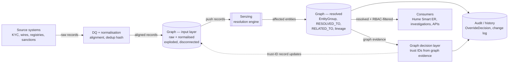

# The Operational Architecture — The Map

## Narrative

Before we go any deeper, we hold up the map. Every phase that follows highlights a different region of it. The next time we say "we are here" — that points at this picture.

### The three components

We use three things, in three roles:

- **Data** — the source systems we operate around (KYC, wires, registries, watchlists, sanctions feeds, anything the customer brings). Records arrive continuously; they are messy; they are non-negotiable. We do not own them; we receive them.
- **Hume / Neo4j** — the graph store. It holds the raw records, the alignment results, the resolved-entity grouping, the relationships between entities, and the audit trail. Everything queryable lives here. We own this layer end to end.
- **Senzing** — the entity resolution engine. It receives records, decides which ones resolve together, and emits the affected entities back. Paco walks the engine's mechanics in Section 06 — what we describe here is the role it plays in the operational architecture, not the algorithm. For the algorithm and the configuration model, hold the question until Section 06.

The discipline of the workshop is keeping these three roles distinct in our heads. The data is what we receive. The graph is where we keep our knowledge. Senzing is the engine we delegate the hard call to.

### The full architecture

(Mermaid source mirrored in `assets/diagrams/04_master_architecture.mmd`. The slide repo should render this once and produce a "we are here" variant for each phase by highlighting the relevant region.)

### The six phases on the map

We will walk this loop in six phases. Each phase highlights a region of the diagram above:

| Phase | Highlights | What we cover                                                          |
| ----- | ---------- | ---------------------------------------------------------------------- |
| 1     | `SRC → DQ → GIN` | Data arrives, gets cleaned, lands in the graph exploded but disconnected |
| 2     | `GIN → SZ → GOUT` | Graph nodes and their neighbourhood are mapped to Senzing-compliant feature JSON and pushed; resolved entities come back as affected-entity events that update the graph |
| 3     | `GOUT` (over time) | The same nodes change as new evidence lands — growth, merge, split    |
| 4     | `GOUT → AUDIT` | Everything the graph does has to be explainable and observable         |
| 5     | `HEUR ⇢ GIN` (dotted edge) | The graph tells Senzing what it cannot see, via trust-ID record updates |
| 6     | `GOUT → CONS` | Analysts and downstream systems use the result through Hume Smart ER   |

The dotted edge from `HEUR` back into `GIN` is the part most ER architectures skip. It is the part that turns this from a one-way pipeline into a system that gets sharper over time. We will earn that edge in Phase 5.

### Two things worth being explicit about now

So the rest of the workshop reads clean:

- **The graph holds the records, not the consolidated entity.** When Senzing tells us "record A and record B are the same entity", the graph stores that grouping as a join node (an `EntityGroup` — full model in Phase 2). The records themselves remain separate, attached to their sources. We never fuse them. The reason is RBAC: a user's access is scoped by source, and fusion would mix sources irrecoverably. We will hit this hard in Phase 2.
- **Senzing is the source of truth for resolution.** Even when the graph generates an override in Phase 5, the override does not mutate the graph directly — it goes back through Senzing, expressed as a trust-ID update on records, and the resulting resolution change comes back the same way any other resolution change would. The graph never quietly disagrees with the engine.

These two rules are why the architecture has the shape it has. Hold them as you watch the phases.

- **The `GIN → SZ` arrow implies a mapping step.** A node in the graph is not a Senzing record. Turning one into the other is an explicit engineering task: node properties flatten to scalar feature fields (`NAME_FULL`, `DATE_OF_BIRTH`, `PASSPORT_NUMBER`), and the node's neighbourhood shape contributes too — aliases modelled as separate connected nodes become additional `NAME_TYPE: ALIAS` entries; organisational relationships become `GROUP_ASSOCIATION` features; `RELATIONSHIPS[]` pointers carry the inter-entity network Senzing needs to reason across. Getting this mapping right — and keeping it maintained as the graph schema evolves — is one of the places the operational architecture can quietly fail. Section 07 walks the mapping code in detail.

## Speaker notes

- This is the single slide the audience needs to retain. Spend 7 minutes on it. Walk every box, walk every arrow, name what crosses each arrow.
- The "we are here" map is the most important pacing device in the new outline. Reinforce it now and reinforce it every phase.
- The dotted edge from HEUR is the question the audience will lean in on. Promise the explanation in Phase 5; do not pre-explain.
- Christophe owns this section even if Paco co-anchors the room — the master map crosses both companies' surfaces and one voice setting it up is easier to follow.

## Assets

- `assets/diagrams/04_master_architecture.mmd` — the master architecture diagram referenced by every phase.

## Open questions

Moved to [`../TODOS.md`](../TODOS.md).
