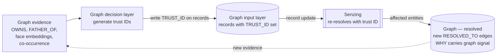

# Phase 5 — The Graph Decision Layer and Trust IDs

> **We are here:** `HEUR ⇢ GIN`. The dotted edge in the master diagram. The graph tells Senzing what the engine cannot see.

## Narrative

Senzing makes resolution decisions from the features in each record. The graph sees something Senzing does not: the *neighbourhood* of those records — the relationships, the structural facts, the things that are true about the data because of how it connects, not because of what is inside any one record. This neighbourhood often contains evidence the engine cannot use, because the engine does not see graphs. We do. And we can feed what we see back in.

This is the **reinforcement edge** in the architecture. It is what turns the pipeline from one-way to closed-loop. It is also where GraphAware + Senzing is more than the sum of the parts.

### Why graph heuristics cannot live inside Senzing

A natural question: why not just give Senzing the graph? Why have a separate decision layer?

Two reasons:

- **Senzing's contract is per-record.** It scores features within and across records. The structural facts of the surrounding graph — "these two `EntityGroup`s sit in different communities", "this entity *owns* that entity" — are not features of any one record. Pushing them into a record as synthetic features would distort the scoring and break the engine's contract.
- **The graph is a different observation point.** It sees emergent structure that no single record carries. We use that observation to *reinforce* resolution, not to replace it.

So we build the graph decision layer as a separate component. It reads the graph, computes signals, and influences Senzing — without pretending to be Senzing.

### Examples — what the graph sees that Senzing cannot

Three shapes we hit in real engagements:

- **Two businesses Senzing resolved together — but the graph says they cannot be the same.** Senzing scored two registry records for the same legal name, same address, similar registration dates, and resolved them into one `EntityGroup`. The graph carries an `OWNS` relationship from one to the other: company A owns company B. A company cannot own itself. The graph's structural fact contradicts the engine's per-feature decision. They cannot be the same legal entity. **Force apart.**
- **Two persons Senzing resolved together — but the graph says they cannot be the same.** Same name, same DOB, two records, resolved. The graph carries a `FATHER_OF` relationship between them — record A is the father of record B. Sons are not their fathers. The graph contradicts. **Force apart.**
- **Two records Senzing left separate — but the graph says they should be the same.** Two `Person` records, different sources, name spellings just outside Senzing's match threshold. The graph holds a face-embedding vector on each record and the cosine similarity is 0.94 — above the calibrated threshold for "same face". The records are about the same person. Per-feature scoring missed it; the graph signal catches it. **Force merge.**

In every case, the same pattern: structural evidence the engine cannot see drives a *correction* to a resolution the engine made (or did not make) on per-feature evidence alone. The graph does not override — it informs.

### The mechanism — trust IDs

The graph cannot mutate Senzing's resolutions directly. The reasons are the same as the no-fusion rule: Senzing has to remain the source of truth for resolution; the graph never quietly disagrees. So we send the override *into* Senzing, expressed in a form the engine can use natively: **a trust ID attached to the records**.

The mechanic:

1. The graph decision layer computes the candidate from graph evidence (a contradicting `OWNS`, a contradicting `FATHER_OF`, a high face-embedding similarity, a dense high-specificity co-occurrence — whatever signal applies).
2. The decision layer **generates trust IDs** and writes them onto the relevant records in the graph input layer (Phase 1):
   - **Same trust ID** on two records ⇒ "Senzing, these belong together." A force-merge.
   - **Different trust IDs** on two records ⇒ "Senzing, these are not the same." A force-apart.
3. Writing the trust ID is a **record update** — same machinery as any other update from Phase 3. CDC or the trigger picks it up, pushes the updated record to Senzing.
4. Senzing receives the updated records, treats the trust ID as a strong identifier feature, and **re-resolves accordingly**. Same `(DATA_SOURCE, RECORD_ID)`, new payload, deterministic outcome.
5. Affected-entities come back through the same path as any other resolution change. The graph applies them. The new `RESOLVED_TO` edges carry the trust ID — and the *reason* the decision layer generated it — in the `WHY` payload.

The elegance of this mechanic is that it uses **only** the existing record-update path. There is no force-merge or force-apart API endpoint to call, no parallel decision channel, no risk of the graph and the engine drifting out of sync because they communicate through different rails. Trust IDs are just records, and records are what Senzing already takes seriously.

The dotted edge at the bottom is the loop closing: a resolution change is itself new graph evidence, which may surface new candidates. We cap the cycle depth as a safety, but in practice the loop converges quickly because trust IDs are deterministic — same evidence in the same shape produces the same trust ID, and Senzing's idempotence makes the rest of the path stable.

### The discipline — when we generate trust IDs, and when we do not

Not every graph signal earns a trust ID. The discipline matters because trust IDs *override* the engine, and bad overrides damage the system in ways that are painful to unwind. Three rules:

- **Hard contradictions are automatic.** `OWNS` between two business records resolved as the same entity, `FATHER_OF` between two person records resolved as the same entity — these are structural impossibilities. The decision layer writes a force-apart trust-ID pair without human review, with the contradicting relationship recorded as the reason.
- **High-confidence positive signals are automatic.** A face-embedding cosine similarity above a calibrated threshold, combined with consistent other features, triggers a force-merge trust ID. Threshold calibration is per-deployment and reviewed periodically.
- **Anything softer goes to a human.** Dense co-occurrence, community-membership signals, ambiguous shared identifiers — these are *candidates*, not decisions. They surface to a reviewer (typically a **compliance investigator** or **KYC operations reviewer**), who produces a **justification artifact** — an `OverrideDecision` node attached to the lineage — before any trust ID is written. False positives in this layer are expensive; the human-in-the-loop is the right discipline.

`assets/data/11_trust_id_examples.csv` shows three rows: an automatic force-apart driven by `OWNS`, an automatic force-merge driven by face embedding similarity, and a human-reviewed candidate that the analyst rejected after looking at the evidence.

### Overrides and access control

A question that comes up: how does the override path interact with the source-level RBAC from Section 07? If the candidate spans sources a single user cannot see, who initiates the override?

The deliberate split of roles:

- **Candidate generation runs under a `compliance` lens** — the same elevated lens used for audit. The decision layer needs to see across sources to evaluate signals honestly. Restricting it to a single user's RBAC scope would silently bias the candidate set toward over-represented sources.
- **Candidate review respects standard RBAC**, with a clear escalation path. A reviewer who can see only one of the two sources sees the candidate redacted ("this `EntityGroup` may merge with another `EntityGroup` you do not have access to"). They cannot decide alone. The override escalates to a reviewer who holds the union of scopes, typically a senior compliance investigator or a paired-review workflow with a second signatory.

The general posture: *signal* runs across sources because that is where signal lives; *decisions* respect the RBAC scope of the people accountable for them.

### Risks worth naming

We are honest about what can go wrong:

- **Over-trusting embedding similarity.** Face embeddings, address embeddings, name embeddings — all useful, all noisier than they look. Thresholds drift with population and with the embedding model. Calibration is per-deployment and revisited.
- **Feedback drift.** If the decision layer keeps writing trust IDs to correct the same Senzing behaviour, and we never tune the engine's configuration, the system becomes dependent on the override. The trust-ID log is itself a signal for Senzing config tuning. We review it.
- **Audit pressure.** Every trust-ID write is a decision. The `OverrideDecision` node is not optional — it is what an investigator or regulator will ask for first.
- **Loops.** A trust-ID change updates the graph, which may surface new candidates. Idempotence helps — same evidence, same trust ID — but we still cap cycle depth as a safety net.

### Why the loop is worth the complexity

It is tempting to ask: if the graph has this signal, why not let the graph be the source of truth?

Because Senzing brings things the graph cannot: a scoring engine tuned across many customers and many years, an idempotent observable resolution layer downstream consumers can trust, a consistent identity for entities across replays and rebuilds. Replacing it with a graph algorithm would lose all of that. Augmenting it with one keeps it and adds context. **The reinforcement loop is the place where domain context re-enters a resolution pipeline that would otherwise only see features.**

That is the loop closing. That is the whole workshop in one mechanism.

## Speaker notes

- This is the most important section in the workshop. Time discipline matters; do not leave Phase 5 short.
- Trust IDs are *the* mechanism. Land the name. Land what they do. Land that they ride the same record-update rail as everything else — no parallel API.
- The `OWNS` and `FATHER_OF` examples are stronger than abstract co-occurrence. Open with them. Close with the face-embedding example for variety.
- The "discipline" subsection is what a regulator quotes back. Linger.
- The mermaid diagram is the second-most-important picture in the workshop after Section 04's master architecture. Have it on screen for most of the section.

## Assets

- `assets/diagrams/11_trust_id_loop.mmd` — the trust-ID reinforcement loop.
- `assets/data/11_trust_id_examples.csv` — three rows: automatic force-apart on `OWNS`, automatic force-merge on face embedding, human-reviewed candidate rejected.

## Open questions

Moved to [`../TODOS.md`](../TODOS.md).
