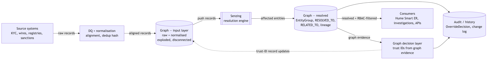
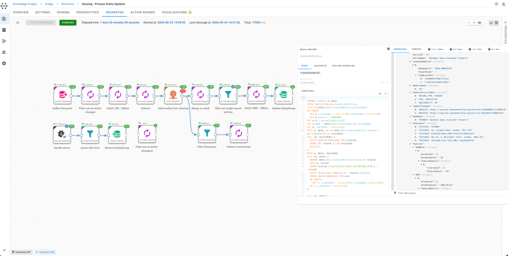
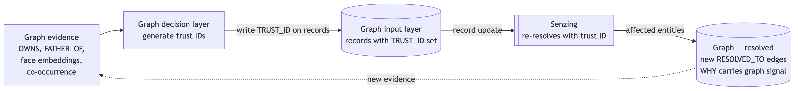

<!-- _class: cover -->
<!-- _paginate: false -->

# Operationalising Entity Resolved Graphs
## From raw records to a production loop

**Paco Nathan · Christophe Willemsen**
Bridge Meetup 2026

---

<!-- _class: cover -->
<!-- _paginate: false -->

# In this workshop…

- Why ER needs to be *operationalised*, not just run
- Data quality as the prerequisite — the work before the engine
- End-to-end architecture: source → graph → Senzing → graph
- Six phases, one loop — navigated with a map
- Graph decision layer: trust IDs close the loop
- Hume 3.0 Smart ER reveal

---

<!-- _class: module -->

# Welcome
## What This Is — and Is Not

---

## This is not a vendor pitch

- Neither GraphAware nor Senzing is selling from this stage
- We will name our products when relevant and stop there
- **Not a product walkthrough** — we run this in Hume because that is where the patterns are most visible; the methodology is the focus
- **Not a fix-everything-from-stage talk** — failure modes named openly

What it is: an end-to-end walk through **operationalising** ER, in six phases, with a map you can navigate. Including a proper explanation of how Senzing works — Paco takes the engine's mechanics in Section 06.

---

<!-- _class: module -->

# Section 01 · 5 min
## Who We Are, Why ER

---

## The gap that is the business model

A criminal opens an account as **Mohammed Al-Rashid** in our KYC system.

Transfers money as **M. Rashid** through our wire system.

Registers a shell company as a **third spelling** in our corporate registry feed.

> Three records. Three systems. Zero connections.

That gap *is* the business model — fraud, AML evasion, sanctions, account-takeover rings. ER closes it.

<!-- 
Open cold with this. Do NOT start with "today we'll cover...".
Start with the criminal. The story sets the tone for the whole workshop.
Christophe introduces Paco with a real credential ("years hardening this engine on financial-crime data"), not just "from Senzing". Paco: same favour back.
Hard time discipline — 5 minutes total for this section. Clock starts when the room sits down.
-->

---

## GraphAware + Senzing: two halves

**GraphAware** builds graph-powered investigation software — Hume — and operationalises large connected-data systems for financial-crime and intelligence use cases. Christophe is GraphAware's CTO.

**Senzing** is the production entity resolution engine the financial-crime and trust-and-safety world reaches for first — configurable, deterministic, hardened on real-world data variation at scale. Paco is from Senzing.

Not competitors. Two halves of the same picture.

The next two hours are about how those halves fit together in production.

---

## What this workshop covers

- A proper walk through **how Senzing works** — Paco takes the engine's mechanics in Section 06
- The full **operational loop**, end to end, in six phases
- Every failure mode we have named in production: geocoding, redo storms, Arabic↔English alignment, force-merge edge cases
- **Hume 3.0** Smart ER in Advanced Expand — the close

---

<!-- _class: module -->

# Section 02 · 6 min
## Operationalising — What Does It Mean?

---

## Demo vs. production ER

**In a demo:** ER decides *once*. Dedupe a CSV, eyeball the diff, ship.

**In production:** ER decides *continuously*. Decisions change as new evidence arrives.

> A record that landed last week may belong to a different entity today.

The graph has to stay consistent. Analysts need to explain a merge made six months ago to a regulator seeing it today. Downstream systems need to know what changed without re-reading everything.

---

## Four properties — the spine of this workshop

| Property | What it means |
|---|---|
| **Near real-time** | Record arrives → affected entities out in seconds, not overnight |
| **Idempotent** | Same records in any order → same graph. Replay is safe. |
| **Observable** | Redo cascades, drift, feature behaviour visible as they happen |
| **Explainable** | Every merge and split points to features and graph evidence. Audit is one query. |

We will return to these four at every phase. They are the checklist.

<!-- 
State these once, clearly. Do not rank them — all four have to hold simultaneously.
Pause between each one when reading aloud.
Avoid "robust" — say what you mean: idempotent, observable, explainable, near real-time.
Forward-reference: "We will hold up the architecture diagram next and show the components those properties live in."
-->

---

## What operationalising is NOT

- Not "we have a server up" — a nightly cron job is in production, not operationalised
- Not "ER with monitoring bolted on" — observability has to be a property of the model
- Not "the resolved entities are in the database, so we're done" — the hard part starts when entities have to *stay* correct as the world moves

---

## How the phases map to the four properties

| Property | Where it lands |
|---|---|
| Near real-time | Architecture (§04) + affected-entities flow (§07) |
| Idempotent | Senzing's contract (§06) + update discipline (§09, Phase 3) |
| Observable | Phase 4 (§10), end to end |
| Explainable | Every phase; hardest in Phase 5 (§11) — decision layer must justify overrides |

---

<!-- _class: module -->

# Section 03 · 11 min
## The Best ER Is the One You Don't Need

---

## The slogan

> **The best ER is the one you did not need to run — not because you bought good tooling, but because you understood your data and did the work.**

If you align correctly, duplicates collapse on a dedup hash and Senzing has nothing left to do. No ER needed. That is not a failure mode — that is the goal.

What you still reach ER for after that is a genuinely hard problem: incomplete evidence, cross-source ambiguity, variation no normalisation step can resolve. **That is exactly where you want Senzing.**

Data quality and alignment are not optional. They are what makes ER cheap, fast, and explainable.

<!-- 
Some in the room will expect us to talk about Senzing here. We deliberately don't. The point is that ER depends on data engineering — it does not replace it.
The hash-as-free-dedup trick is worth pausing on. Most teams skip it.
"Know your data" is the principle. That is what determines whether you need ER at all.
-->

---

## Raw data — what it looks like before we touch it

*Throughout this workshop we use the **min_aml** dataset — a small, public, redactable AML dataset built from OpenOwnership (UK beneficial-ownership records) and OpenSanctions (sanctioned entities). Same physical people; very different strings:*

| Record ID | Full name | DOB | Country |
|---|---|---|---|
| KYC-001 | Dr. Mohammed Al-Rashid | 1982-03-14 | United Arab Emirates |
| WIRE-A12 | Muhammad Al Rashid | 14/03/1982 | U.A.E. |
| REG-2090 | M. Rashid | Mar 14 1982 | AE |
| KYC-002 | Sarah Chen | 1990-07-22 | Singapore |
| WIRE-B07 | Bob Smith | 11/02/1975 | USA |
| KYC-003 | Robert Smith Jr. | 1975-11-02 | US |
| REG-2091 | José María García | 1988-01-30 | Spain |
| KYC-004 | Jose Maria Garcia | 30/01/1988 | ES |

Four people. Eight strings. Zero common characters across some pairs.

---

## The techniques

- **Format alignment** — case, whitespace, punctuation, diacritics. `José María García` → `jose maria garcia`
- **Prefix/suffix expansion** — strip `Dr.`, `Jr.`, `Mr.`; keep in a separate column, don't let them pollute the matching key
- **Company-suffix alignment** — `GmbH` / `G.m.b.H.` / `gmbh` → one canonical form. Same for `Ltd` / `Limited`, `Corp.` / `Corporation`
- **Dictionary enrichment** — country codes → ISO 3166-1 alpha-3, nickname expansion (`Bob` ↔ `Robert`), dates → ISO 8601

Each is a tiny lookup. Together they eliminate most variation Senzing would otherwise have to absorb.

---

## After normalisation — the dedup hash falls out for free

| Record ID | name_norm | dob_norm | country_iso3 | dedup_hash |
|---|---|---|---|---|
| KYC-001 | mohammed al rashid | 1982-03-14 | ARE | `38d2f8ef964b7af1` |
| WIRE-A12 | mohammed al rashid | 1982-03-14 | ARE | `38d2f8ef964b7af1` |
| REG-2090 | mohammed al rashid | 1982-03-14 | ARE | `38d2f8ef964b7af1` |
| KYC-002 | sarah chen | 1990-07-22 | SGP | `419788d799247f30` |
| WIRE-B07 | robert smith | 1975-11-02 | USA | `21a2e7f090ad2cb7` |
| KYC-003 | robert smith | 1975-11-02 | USA | `21a2e7f090ad2cb7` |
| REG-2091 | jose maria garcia | 1988-01-30 | ESP | `616dcf313c6c0d86` |
| KYC-004 | jose maria garcia | 1988-01-30 | ESP | `616dcf313c6c0d86` |

Eight records. Four hashes. Duplicates collapse for free.

---

## The hash: what goes in, what stays out

SHA-256 of `name_norm | dob_norm | country_iso3` — truncated to 16 hex chars.

**What goes in:** stable, normalised, identity-bearing fields only.

**What stays out:** source system, original formatting, honorifics, anything that varies for non-identity reasons.

Fewer records into Senzing → fewer features to evaluate → fewer redos → cleaner signal.

---

## The rule: normalise, don't replace

Two records collapsing to the same hash does **not** mean we delete one.

We keep both. The hash is a *signal*. Records remain separately addressable, with provenance intact.

> **Disk is cheap. Lost signal is permanent.**

Normalisation produces *additional* columns. It never replaces the original.

This is the bridge to Phase 1.

---

<!-- _class: module -->

# Section 04 · 7 min
## The Operational Architecture — The Map

---

## Three components, three roles

| Component | Role |
|---|---|
| **Source data** | What we receive: KYC, wires, registries, watchlists, sanctions feeds. Continuous, messy, non-negotiable. We do not own it. |
| **Hume / Neo4j** | What we own: the graph. Raw records, alignment results, resolved-entity grouping, relationships, audit trail. Everything queryable. |
| **Senzing** | What we delegate the hard call to: the resolution engine. Records in, affected entities out. Paco explains the mechanics in §06. |

Keep these three roles distinct. The data is what we receive. The graph is where we keep our knowledge. Senzing is the engine.

---

<!-- _class: img-bottom -->

## The full architecture

<div class="hero-wrap">



</div>
<div class="img-caption">

Source → DQ → Graph (input) → Senzing → Graph (resolved) → Decision layer → Consumers. The dotted edge from the decision layer back into the input graph is the reinforcement loop — Phase 5 earns it.

</div>

---

## Six phases on the map

| Phase | Highlights | What we cover |
|---|---|---|
| 1 | `SRC → DQ → GIN` | Data arrives, cleaned, lands exploded and disconnected |
| 2 | `GIN → SZ → GOUT` | Records leave the graph; resolved entities come back |
| 3 | `GOUT` over time | Same nodes, different conclusions as evidence arrives |
| 4 | `GOUT → AUDIT` | Movement made visible — observable and explainable |
| 5 | `HEUR ⇢ GIN` (dotted) | Graph tells Senzing what it cannot see, via trust IDs |
| 6 | `GOUT → CONS` | Analysts and downstream systems use the result |

---

## Two rules to hold through the workshop

1. **The graph holds records, not the consolidated entity.** When Senzing says "A and B are the same entity", the graph stores that as a join node (`EntityGroup`). Records stay separate. We never fuse them — RBAC scopes by source.

2. **Senzing is the source of truth for resolution.** Even overrides from Phase 5 go *back through Senzing* via trust-ID updates. The graph never quietly disagrees with the engine.

These two rules are why the architecture has the shape it has. A third: the `GIN → SZ` arrow implies an explicit **mapping step** — graph nodes are not Senzing records. Section 07 walks the mapping code in detail.

<!-- 
This is the single diagram the audience needs to retain. Spend 7 minutes on it.
Walk every box, walk every arrow, name what crosses each arrow.
The dotted edge from HEUR is the question the audience will lean in on — promise the explanation in Phase 5, do not pre-explain.
The "we are here" map is the most important pacing device in the workshop — reinforce it at every phase.
Christophe owns this section — one voice setting up the master map is easier to follow.
-->

---

<!-- _class: module -->

# Phase 1 · 6 min
## Data In, Exploded, Disconnected

---

<!-- _class: img-bottom -->

## We are here

<div class="hero-wrap">


</div>
<div class="img-caption">

**Phase 1: SRC → DQ → GIN.** Data arrives from source systems, gets cleaned and aligned, and lands in the graph input layer — exploded into nodes and relationships, but disconnected: no entity has been resolved yet.

</div>

---

## Three properties Phase 1 must deliver

- **Cleaned, not destructively** — normalised columns sit beside the raw payload. Both kept.
- **Exploded** — each record is pulled apart so attributes are independently addressable: names, identifiers, addresses, phones, dates each become a node.
- **Disconnected** — no `EntityGroup`, no `RESOLVED_TO`, no claim that two records refer to the same real-world entity. That call belongs to Senzing.

---

## What "exploded" looks like

```
(:Source {code: "KYC"})
  <-[:FROM]- (:Record:Person {
                record_id:          "KYC-001",
                name:               "mohammed al rashid",
                date_of_birth:      "1982-03-14",
                nationality:        "ARE",
                raw_payload:        {...},
                normalised_payload: {...},
                dedup_hash:         "38d2f8ef964b7af1"})
              -[:HAS_PASSPORT]-> (:Passport {number: "P12345678", country: "ARE"})
              -[:HAS_ADDRESS]->  (:Address  {full: "12 Frederick Street, Port of Spain"})
```

**Scalar attributes** — name, DOB, nationality — sit as properties on the `:Record` node. **Shared identifiers** — passport, address, phone — become their own nodes, linked back. Two records sharing passport `P12345678` attach to the **same** `:Passport` node — a structural fact, before any resolution.

---

<!-- _class: img-left -->

## Exploded, not yet resolved

<div class="columns">
<div class="col-img">


</div>
<div class="col-content">

Two disconnected clusters. Top: *Gold Wynn UK Holdings Limited* (`12524623`) + *Jeffrey Weinzweig*. Bottom: *GOLD WYNN UK HOLDINGS LIMITED* (same reg) + *Jeffrey Mark Weinzweig*. Same company, same person — different source, different name string, **no edge between them**.

The graph holds structural facts. It does **not** declare them the same entity — that declaration is Senzing's call.

The minute Phase 1 starts making resolution decisions, the architecture loses the invariant that *Senzing is the source of truth*.

</div>
</div>

---

## What we get for free at the end of Phase 1

Before any ER has run, the graph does useful work:

- **Source-volume reporting** — how many KYC records today? How many wires?
- **Attribute reachability** — how many records carry a passport? A phone?
- **Naive co-occurrence** — which addresses appear in more than ten records? (shell detection)
- **Dedup-hash audit** — which raw records collapsed to the same hash, across which sources?

Phase 1 is a deliverable, not just a setup step. Value in week one, not week twelve.

---

<!-- _class: module -->

# Phase 2 · 14 min
## Senzing Fundamentals (Paco's Deep Dive)

<!-- 
THIS IS PACO'S BLOCK — 14 minutes. The longest single section.
We provide the vocabulary slides and the round-trip structure; Paco brings the substance and the engine internals.
Christophe: hand off cleanly. "Time for Paco to tell us what the engine actually does."
Paco: stay descriptive, not comparative. The audience came to understand the engine — not to compare it.
Don't lose the configuration-model beat to time pressure. It's the difference between "we use Senzing" and "we know how to deploy Senzing".
-->

---

<!-- _class: img-bottom -->

## We are here

<div class="hero-wrap">


</div>
<div class="img-caption">

**Phase 2: GIN → SZ.** Records are about to leave the graph and meet the engine. Before we send them: how Senzing actually does its job.

</div>

---

## Three concepts — nail the vocabulary now

| Name | What it is |
|---|---|
| **Record** | One piece of evidence from one source, identified by `(DATA_SOURCE, RECORD_ID)`. Immutable in our model. |
| **Entity** | Senzing's resolved identity — the cluster of records that refer to the same real-world person, company, or asset. |
| **`EntityGroup`** | Our graph-side label for Senzing's entity. We use `EntityGroup` to avoid overloading "entity". **Whenever Paco says "entity", we mean `EntityGroup`.** |

---

## How Senzing decides — the engine, step by step

1. **Feature extraction** — raw strings → typed, comparable features: name parts, address components, identifier values, dates, phones. The engine matches *features*, not strings.

2. **Candidate retrieval** — find the small set of existing records the new one *could* match, using indexed features. This is what makes resolution fast at scale.

3. **Feature scoring** — per-feature confidence: how strong is the name match? The address? The identifier? The DOB? Different features carry different specificity.

4. **Resolution call** — compose per-feature scores into one outcome: match into existing entity, create new entity, possible-match, possibly-related.

---

## The configuration model

Senzing is **configurable** — configuration is what makes it fit a domain.

- Data sources (with per-source trust weights)
- Entity types (person, organisation, …)
- Feature definitions (which fields map to which features)
- Scoring rules (thresholds, combination logic)

Financial-crime, trust-and-safety, and customer-data resolution share the same engine, but ship with different configurations.

> The configuration model is the difference between "we use Senzing" and "we know how to deploy Senzing".

---

<!-- _class: code-left -->

## A round-trip: the input record

<div class="columns">
<div class="col-code">

```json
{
  "DATA_SOURCE": "KYC",
  "RECORD_ID": "P001",
  "RECORD_TYPE": "PERSON",
  "NAMES": [
    {
      "NAME_TYPE": "PRIMARY",
      "NAME_FULL": "Mohammed Al-Rashid"
    }
  ],
  "DATE_OF_BIRTH": "1982-03-14",
  "ADDRESSES": [
    {
      "ADDR_TYPE": "HOME",
      "ADDR_FULL": "12 Frederick Street, Port of Spain",
      "ADDR_COUNTRY": "TT"
    }
  ],
  "IDENTIFIERS": [
    {
      "ID_TYPE": "PASSPORT",
      "ID_NUMBER": "AE9981772",
      "ID_COUNTRY": "AE"
    }
  ]
}
```

</div>
<div class="col-content">

- `DATA_SOURCE` + `RECORD_ID` uniquely identify the record — never rename in production
- `NAMES`, `ADDRESSES`, `IDENTIFIERS` are feature blocks — typed arrays
- Send what we know. Empty = unknown. Do **not** invent placeholders.

</div>
</div>

---

<!-- _class: code-left -->

## A round-trip: affected entities out

<div class="columns">
<div class="col-code">

```json
{
  "DATA_SOURCE": "KYC",
  "RECORD_ID": "P001",
  "AFFECTED_ENTITIES": [
    {
      "ENTITY_ID": 1001,
      "LENS_CODE": "DEFAULT",
      "MATCH_LEVEL_CODE": "RESOLVED",
      "WHY": [
        { "FEATURE": "NAME",    "SCORE": 92 },
        { "FEATURE": "DOB",     "SCORE": 100 },
        { "FEATURE": "ADDRESS", "SCORE": 78 }
      ]
    }
  ]
}
```

</div>
<div class="col-content">

- Output is **affected entities** — not the full resolved store
- `ENTITY_ID` → the `EntityGroup` we create or update in the graph
- `WHY` → the per-feature scores we store on the `RESOLVED_TO` edge
- We never re-read the full entity store after every push

</div>
</div>

---

## Determinism and idempotence — the contract

> Same engine version + same configuration + same records in any order = **same resolution**.

Operationally:

- Push twice → same result. **Safe to replay.**
- Crash mid-batch, replay the batch. No corruption.
- Rebuild a downstream index, replay. Same graph.

One precision: *replay* means re-sending the same payloads. If upstream state changed, that is a *new ingest*, not a replay — and the outcome will (correctly) differ.

---

<!-- _class: module -->

# Phase 2 · 11 min
## From Graph Records to Senzing

---

<!-- _class: img-bottom -->

## We are here

<div class="hero-wrap">


</div>
<div class="img-caption">

**Phase 2: GIN → SZ → GOUT.** Records leave the graph for Senzing; resolved entities come back and become `EntityGroup` nodes with `RESOLVED_TO` edges.

</div>

---

## Pushing records — CDC vs. triggers

**Change Data Capture (CDC)**
The graph's transaction log emits a change stream. A consumer filters for new/updated `:Record` nodes that have passed alignment and pushes to Senzing. Right when the customer already has Kafka, Pulsar, or Kinesis.

**Trigger-based**
A Cypher trigger fires on `:Record` creation and enqueues the push. Right when CDC is not already in the stack and data scale fits.

Both work. Both are idempotent on Senzing's side. The choice is dictated by the customer's stack, not by Senzing.

<!-- 
CDC versus triggers is the audience's call, not ours. Present them as alternatives. 
Engineers in the room will know immediately which one fits their stack — don't push.
-->

---

<!-- _class: img-bottom -->

## The pipeline in action

<div class="hero-wrap">



</div>
<div class="img-caption">

Hume Orchestra pipeline: source data → normalisation → record push to Senzing → affected-entities response handler → `EntityGroup` write to the graph. Each stage is independently observable and replayable.

</div>

---

<!-- _class: code-left -->

## The mapping: graph → Senzing JSON

<div class="columns">
<div class="col-code">

```cypher
MATCH (r:Record {record_id: $id})
      -[:FROM]->(src:Source)
OPTIONAL MATCH (r)-[:HAS_NAME]->(n:Name)
OPTIONAL MATCH (r)-[:HAS_DOB]->(d:DOB)
OPTIONAL MATCH (r)-[:HAS_PASSPORT]->(p:Passport)
OPTIONAL MATCH (r)-[:HAS_ADDRESS]->(a:Address)
OPTIONAL MATCH (r)-[:HAS_PHONE]->(ph:Phone)
RETURN {
  DATA_SOURCE:      src.code,
  RECORD_ID:        r.record_id,
  NAME_FULL:        n.value,
  DATE_OF_BIRTH:    d.value,
  PASSPORT_NUMBER:  p.value,
  PASSPORT_COUNTRY: p.country,
  ADDR_FULL:        a.value,
  PHONE_NUMBER:     ph.value
} AS payload
```

</div>
<div class="col-content">

- Flatten the exploded graph back into Senzing's feature-oriented JSON
- **Send what we know, no more.** Missing features = unknown. Invented placeholders create false matches.
- `DATA_SOURCE` and `RECORD_ID` are not metadata — Senzing uses them for security, weighting, and addressability.

</div>
</div>

<!-- 
Engineers will photograph this slide. Keep it readable on screen — don't rush past it.
"DATA_SOURCE and RECORD_ID are not metadata" is the one line that saves them a painful debugging session later.
-->

---

## What comes back — the affected-entities response

```json
{
  "DATA_SOURCE": "KYC",  "RECORD_ID": "P001",
  "AFFECTED_ENTITIES": [
    {
      "ENTITY_ID": 1001,
      "MATCH_LEVEL_CODE": "RESOLVED",
      "WHY": [
        { "FEATURE": "PASSPORT", "SCORE": 100 },
        { "FEATURE": "NAME",     "SCORE": 92  }
      ]
    },
    {
      "ENTITY_ID": 1002,
      "MATCH_LEVEL_CODE": "RETIRED",
      "MERGED_INTO": 1001
    }
  ]
}
```

Entity 1002 was absorbed into 1001. We keep it in the graph — never delete retired entities.

---

<!-- _class: img-left -->

## What WHY looks like in practice

<div class="columns">
<div class="col-img">


</div>
<div class="col-content">

- Two records resolved into one entity
- Senzing surfaces per-feature scores: **Name**, **National ID**, **Registration Date**
- This is the `WHY` payload — we attach it to the `RESOLVED_TO` edge in the graph
- Analysts query it directly in Phase 4
- **No mystery merges**

</div>
</div>

---

## Writing affected entities to the graph

For each affected entity:

1. **Find or create** the `:EntityGroup` node, keyed by `ENTITY_ID`
2. **Attach the record** via `-[:RESOLVED_TO]->`, carrying `MATCH_LEVEL_CODE` and `WHY` as edge properties
3. **Retired entities** — mark with `merged_into` pointer, keep in history. Never delete.
4. **Stamp every change** with the triggering record + timestamp → basis for Phase 4 observability

---

<!-- _class: img-left -->

## Source → Record → EntityGroup

<div class="columns">
<div class="col-img">


</div>
<div class="col-content">

```
(:Source)
  <-[:FROM]-
    (:Record)
      -[:RESOLVED_TO {
          match_level,
          why,
          decided_at
        }]->
    (:EntityGroup {
        entity_id,
        last_affected_at
      })
```

`EntityGroup` carries Senzing's `entity_id` and timestamps. It does **not** carry consolidated record properties.

</div>
</div>

---

## The no-fusion rule — RBAC by source

**We never fuse record properties into the `EntityGroup`.**

If we merged attributes from multiple sources onto a single node, a KYC-only analyst would see attributes derived from wires records they are not entitled to — with no clean way to redact that.

**Aggregation happens at query time, RBAC-filtered to the records the caller can see.**

The `EntityGroup` itself is visible across sources — an analyst should know there is a resolution group, even if they cannot see all its contents. What they cannot see is content from sources outside their scope.

<!-- 
Spend time here. The no-fusion rule will surprise some of the room.
Compliance officers will quote this back. Say it clearly: "We never fuse records into the EntityGroup."
This is the single rule that makes the architecture compatible with how customers actually run access control.
-->

---

<!-- _class: module -->

# Section 08 · 6 min
## The Depth of the Engine — What You'd Never Build Yourself

<!-- 
Paco leads this block. His job: show the room things they would not have thought of.
Open with the Kerimova record — pull it up, read the four scripts out loud, let it land.
The Greek-script Cyprus address is the second strongest visual — show it without translating it first.
The build-vs-buy argument is deliberately blunt. Do not soften it.
-->

---

<!-- _class: img-bottom -->

## We are here

<div class="hero-wrap">


</div>
<div class="img-caption">

**Still inside SZ.** Before we leave Phase 2: what Senzing handles natively — so we do not duplicate it upstream.

</div>

---

## Firuza Kerimova: 1 record, 13 aliases, 4 scripts

Record `NK-dNNN56A4ApVfUFvfzniLCF` from `open-sanctions.json` — one OFAC-sanctioned person:

| Type | Variant |
|---|---|
| Latin primary | `Firuza Nazimovna Kerimova` |
| Latin aliases | `KERIMOVA, Firuza Nazimovna`, `Firuza Kerimova`, `Kerimova Firuza` |
| Married name | `Firuza Nazimovna Khanbalaeva`, `Firuza Kerimova (Khanbalaeva)` |
| Russian Cyrillic | `Керимова Фируза Назимовна` |
| Ukrainian Cyrillic | `Керімова Фіруза Назимівна` |
| Alternate romanisation | `Kerimova Firuza Nazymivna` |
| Japanese katakana | `フィルザ・ケリモウ゛ァ(ハンバラエウ゛ァ)` |

All in one record's `NAMES` array. **Senzing handles this natively.** We send all aliases; the engine compares across scripts.

---

## Address handling in non-Latin script

Record `NK-auyPsLrBzRoxjCRWgjBvas` — `WANDLE HOLDINGS LIMITED`, Cyprus:

```
DEANA BEACH APTS, BLOCK A, Flat 212,
Προμαχών Ελευθερίας, 33,
Άγιος Αθανάσιος, 4103, Λεμεσός, Κύπρος
```

Latin building name + Greek street name + Greek city (Λεμεσός = Limassol) + Greek country.

**Senzing accepts and matches against Greek script directly.** We do not transliterate upstream.

Same record also shows identifier normalisation: `C188266` and `HE188266` — the same Cyprus registration number with and without the `HE` (limited company) prefix. Senzing matches across both.

---

## Address parsing: same place, four shapes

Firuza Kerimova's Moscow address, four ways it appears:

```
1.  MOSCOW, RUS, 123430
2.  Apt. 270, Build. 31, Pyatnitskoe Shosse, 123430 Moscow
3.  Apt 270, Build. 31, Pyatnitskoe Shosse, Moscow, 123430
4.  ADDR_LINE1: Apt 270, Build. 31, Pyatnitskoe Shosse
    ADDR_CITY:  Moscow  |  ADDR_COUNTRY: ru  |  ADDR_POSTAL_CODE: 123430
```

Variant 1: postcode only. Variants 2-3: full string, different order. Variant 4: pre-parsed.

`ADDR_FULL` for unstructured; component fields when we have them. **We do not have to normalise these into one form before pushing.**

---

## Where we still need to help: the receipts

**Country mismatch in source records**

`open-ownership.json`, record `10442160967680700142` — **Helena Antoinette Marie Verbeek**:

```
ADDR_FULL:    28 Charlotte Square, Edinburgh, EH2 4ET
ADDR_COUNTRY: NL     ← Netherlands
NATIONALITY:  GB     ← Great Britain
```

Edinburgh postcode `EH2 4ET` is unambiguously Scotland. The country code says Netherlands. **Senzing cannot reconcile this** — only the upstream system can.

---

## Where we still need to help: native script

The Kerimova record carries Cyrillic and Japanese aliases because **the OFAC source preserved them**.

If an upstream KYC system stripped to ASCII (as many do), those aliases would be irrecoverable. Senzing would still match Latin variants — but never against a future Cyrillic-source record.

> **When we have native script, we keep it. We never normalise to ASCII upstream.**

---

## The honest message

| Senzing handles natively | We still own |
|---|---|
| Multi-script name matching | Country anchors in records |
| Non-Latin address matching | Native-script preservation |
| Address variant parsing | Source attribution |
| Identifier format variants | Country-address consistency checks |
| Cross-cultural name conventions | — |

**Buy the engine. Own the thin layer. That is the correct split.**

This is not an advertisement. It is an accounting problem. Teams that have tried to build what the Kerimova record demonstrates have spent more than the licence cost — and most did not have the right people.

---

<!-- _class: module -->
<!-- _paginate: false -->

# Audience Pause
## Three Questions from the Floor

*Up to 5 minutes — strict.*

If no questions: "By show of hands — who is running ER in production today?"

<!-- 
Up to 3 questions, strict. If a question opens a longer conversation, park it for the end.
If no questions come: "By show of hands — who is running ER in production today?" or "who has a graph already?" — calibrates the room before Phase 3.
Paco co-anchors this. Questions in this room often go to him.
Transition out: "We said Senzing is idempotent. Phase 3 is what that buys us when the data starts moving."
-->

---

<!-- _class: module -->

# Phase 3 · 10 min
## A Living Architecture

---

<!-- _class: img-bottom -->

## We are here

<div class="hero-wrap">


</div>
<div class="img-caption">

**Phase 3: GOUT over time.** Same nodes, same engine — different conclusions as evidence arrives. This is what near real-time ER actually looks like in production.

</div>

---

## Idempotence: the property the loop depends on

Paco set this up in §06. We lean on it now.

**Idempotence:** same engine version + same config + same records in any order = same resolution.

This is what makes recovery, re-ingestion, and rebuilds **safe**:
- Crash mid-batch → replay the batch
- Re-ingest a source → replay
- Rebuild a downstream index → replay

**Critical discipline upstream:** record payload must be a pure function of source-of-truth state. No timestamps in features, no monotonic sequence numbers, no `last_modified` in matching keys. If it leaks in, idempotence breaks.

---

## Updates and deletes: two rules

**Update = new versioned record, not mutation.**
Land a new immutable version, link it to the prior version, push the new payload to Senzing. Graph keeps both — old version stays queryable for history.

**Delete = soft delete, marked, never erased.**
Hard deletion is a one-way door we never take. Mark the record deleted with event + timestamp. Tell Senzing the record is no longer evidence. Graph keeps it — we need to answer "what did the system think a year ago".

> [verify with Paco] Exact Senzing API surface for marking a record deleted and the resulting affected-entities behaviour.

---

## Three behaviours at the EntityGroup level

**Growth** — a new record falls into an existing `EntityGroup`, adding features without changing its identity. Most events are growth events.

**Merge** — a new record carries enough evidence (typically a strong identifier like a passport) to link two previously separate `EntityGroup`s. One absorbs the other; the absorbed one is marked `merged_into` and stays in history.

**Split** — a new record contradicts a prior grouping (corrected identifier, registry update). The `EntityGroup` fractures; records reassign across the resulting groups. Original may remain or be retired.

---

## Update timeline: growth → merge → split

| Step | Time | Event | Entities affected | What happened |
|---|---|---|---|---|
| 1 | T+0s | push P001 (KYC) | 1001 created | New entity from KYC record |
| 2 | T+12s | push P002 (wires) | 1001 | Name+DOB match — growth |
| 3 | T+45m | push P003 (registry) | 1001 | Passport AE9981772 added — growth |
| 4 | T+3h | push P099 (wires) | 1001 ← 1042 | Shared passport triggers merge |
| 5 | T+1d | push P150 (KYC) | 1001 | Phone added, no redo cascade |
| 6 | T+2d | push P200 (registry) | 1001, 1042 split | Registry update contradicts passport — split |
| 7 | T+3d | push P201 (KYC) | 1042 | New record lands on split entity |

Same pipeline. Same Senzing instance. Same records. Different conclusions at different times.

---

## Manual overrides: force-merge and force-apart

The engine decides automatically. Analysts know things the engine cannot see.

**Force-merge.** Two `EntityGroup`s the engine kept separate — name transliteration off, identifier absent from one source, match fell just below threshold. Analyst selects both, hits merge, confirms. Hume translates into the Senzing override; the collapse is recorded with an `ANALYST_MERGED` relationship carrying who merged it and when.

**Force-apart.** Two records the engine resolved together — common-name collision, shared address that does not reflect shared identity. Analyst flags the conflicting records as distinct. Senzing keeps them apart; an `ANALYST_SEPARATED` relationship carries the same audit trail.

Both operations are **reversible**. The override, the reversal, and the timestamps all stay in the graph.

<!-- 
Have the Hume interface open. Show the actual select-and-merge gesture live — two clicks, confirm dialog, done.
The point is the contrast: without this, overrides require custom tooling, direct API calls, and no audit trail.
Keep under 2 minutes. The automated version (trust IDs from the decision layer) is Phase 5.
Stress reversibility. "A force-merge is not a hard edit — the graph never forgets it happened."
-->

---

## What to expect in production

- **High-specificity identifiers trigger the largest changes.** A new passport can collapse two `EntityGroup`s or split one. The redo cascade is dominated by identifier ingestion.
- **Sources behave differently.** Registry corrections produce splits; KYC pipelines produce growth. The mix shifts daily.
- **Stability is a function of evidence, not time.** An `EntityGroup` is *stable under current evidence*. Never say "stable" without that qualifier.

The graph carries the full history of these transitions. Phase 4 is how we surface it.

---

<!-- _class: module -->

# Phase 4 · 9 min
## Explainability, Observability, and an Audit-History Idea

---

<!-- _class: img-bottom -->

## We are here

<div class="hero-wrap">


</div>
<div class="img-caption">

**Phase 4: GOUT → AUDIT.** Everything the engine and the graph do has to be inspectable, queryable, and survivable under audit.

</div>

---

<!-- _class: code-left -->

## Explainability: every merge has a justification

<div class="columns">
<div class="col-code">

```cypher
MATCH (r:Record {record_id: $record_id})
      -[rel:RESOLVED_TO]->
      (eg:EntityGroup)
RETURN
  rel.match_level,
  rel.why,
  rel.decided_at,
  eg.entity_id
```

</div>
<div class="col-content">

Every `RESOLVED_TO` edge carries the **`WHY` payload** from Senzing as edge properties.

Per-feature evidence + graph-evidence trail on the same edge.

An investigator asking "why did these collapse?" gets both in one query.

**No mystery merges. Ever.**

</div>
</div>

---

## Two design principles for usable ER

**Show the entity, not the records.**
Every UI surface defaults to the entity view. Records are how the data arrived; the entity is what the human is reasoning about.

**Show the `WHY` for every resolution.**
No mystery merges. Every edge, every membership, every alert carries its evidence as a click-through.

These are the two most common gaps in ER implementations. Both are architectural choices made at Phase 2. They are hard to retrofit.

---

## Observability: dashboards from the graph

Five metrics worth tracking in production:

| Metric | What it signals |
|---|---|
| **Redo rate per ingestion batch** | High → high-specificity feature landed; anticipate load |
| **Affected-entity count distribution** | Long tail (50+ entities per push) = redo storm; investigate |
| **Entity stability over time** | Highly unstable `EntityGroup`s = contested or noisy config |
| **Feature-level resolution behaviour** | One feature dominates → overweighted; tune the config |
| **Source-level redo contribution** | One source drives excess redo → Section 03 data quality problem |

**All of these are graph queries.** Timestamps on every edge change, a small event log per `EntityGroup`. No separate metrics stack needed.

---

## Surviving a redo storm

<!-- 
Paco leads the redo and redo-storm content. Christophe hands off here and picks up again at Observability.
Paco: worked example on screen — min_aml or a small synthetic set showing a cascade step by step is ideal.
-->

A storm will happen. What saves us:

- **Replayable ingestion** — broken batch? Re-ingest the corrected version. Senzing is idempotent.
- **Lineage on every change** — every resolution change carries the triggering record. Tracing a storm to its source is one query.
- **Source-level rate control** — the graph input layer sits between source and Senzing. Right place to throttle a misbehaving source.
- **Hold and review** — for patterns that historically cause storms (passport-rich registry feed), buffer, ingest a sample, observe distribution, then push the rest.

The posture: redo is good, redo storms are an operational signal. We want to *see* them, not suppress them.

---

## An explicit audit-history layer — the question

Today, history is implicit: timestamps on edges, versioned records, retired `EntityGroup`s.

**The hypothetical:** first-class audit history:
- `OverrideDecision` node for every trust-ID intervention — reviewer, evidence, resulting change
- `ChangeEvent` node for every affected-entities event — triggering record, prior state, new state
- `Snapshot` mechanism — "the graph as of time T", without replay

**Trade-off:** more storage, more write amplification, more model surface.
**Win:** audit becomes a primitive, not a project.

> **Open question for the room: how much explicit audit history do you actually need, and what would you sacrifice to get it?**

---

<!-- _class: module -->

# Phase 5 · 13 min
## The Graph Decision Layer and Trust IDs

---

<!-- _class: img-bottom -->

## We are here

<div class="hero-wrap">


</div>
<div class="img-caption">

**Phase 5: HEUR ⇢ GIN — the dotted edge.** The graph tells Senzing what it cannot see. This is what turns the pipeline from one-way to closed-loop.

</div>

---

## Why graph heuristics cannot live inside Senzing

A natural question: why not just give Senzing the graph?

**Senzing's contract is per-record.** It scores features within and across records.

The structural facts of the surrounding graph — "these two `EntityGroup`s sit in different communities", "this entity *owns* that entity" — are not features of any one record. Pushing them in as synthetic features would distort scoring and break the engine's contract.

**The graph is a different observation point.** It sees emergent structure no single record carries. We use that to *reinforce* resolution, not to replace it.

---

## What the graph sees that Senzing cannot

**Shape 1 — Hard contradiction (business)**
Senzing resolved two registry records: same legal name, same address. The graph carries `(REG-501)-[:OWNS]->(REG-742)`. A company cannot own itself. **Force apart.**

**Shape 2 — Hard contradiction (person)**
Senzing resolved two KYC records: same name, same DOB. The graph carries `(KYC-803)-[:FATHER_OF]->(KYC-955)`. Sons are not their fathers. **Force apart.**

**Shape 3 — Positive signal below threshold**
Two `Person` records, different sources, name spellings just outside Senzing's match threshold. The graph holds face-embedding vectors; cosine similarity = 0.94, above the calibrated threshold. **Force merge.**

In every case: structural evidence the engine cannot see drives a correction to a resolution the engine made (or did not make) on per-feature evidence alone.

---

## The mechanism: trust IDs — step by step

1. Graph decision layer detects the candidate from graph evidence (`OWNS`, `FATHER_OF`, face embedding, …).
2. Decision layer **generates trust IDs** and writes them to the records in the graph input layer:
   - **Same trust ID** on two records → "Senzing, these belong together." Force merge.
   - **Different trust IDs** on two records → "Senzing, these are not the same." Force apart.
3. Writing the trust ID is a **record update** — same CDC/trigger path as any other update.
4. Senzing receives the updated records, treats the trust ID as a strong identifier feature, **re-resolves**.
5. Affected entities come back. New `RESOLVED_TO` edges carry the trust ID *and the reason the decision layer generated it* in the `WHY`.

**No parallel API. No separate channel. Trust IDs are just records.**

---

<!-- _class: img-bottom -->

## Trust ID reinforcement loop

<div class="hero-wrap">



</div>
<div class="img-caption">

The loop converges quickly: trust IDs are deterministic — same evidence in the same shape produces the same trust ID — and Senzing's idempotence makes the rest of the path stable.

</div>

---

## Trust ID examples — from the field

| Case | Senzing before | Graph signal | Action | Outcome |
|---|---|---|---|---|
| TID-001 | RESOLVED (same name/addr) | `(REG-501)-[:OWNS]->(REG-742)` | auto force-apart | Split into EG-4011, EG-4012 |
| TID-002 | RESOLVED (same name, DOB yr) | `(KYC-803)-[:FATHER_OF]->(KYC-955)` | auto force-apart | Split into EG-7220, EG-7221 |
| TID-003 | POSSIBLY_RELATED | face cosine = 0.94 > threshold 0.88 | auto force-merge | Merged into EG-9105 |
| TID-004 | POSSIBLY_RELATED | 4 shared addresses, 9 shared counterparties | human-reviewed → approved | Merged into EG-4055 with justification |
| TID-005 | POSSIBLY_RELATED | same Louvain community only | human-reviewed → **rejected** | No trust ID written; entities stay separate |

Community membership alone is a prior — never a decision input.

---

## The discipline — when we generate trust IDs

**Hard contradictions → automatic.**
`OWNS` between two resolved business records, `FATHER_OF` between two resolved person records — structural impossibilities. Decision layer writes force-apart without human review, with the contradicting relationship as reason.

**High-confidence positive signals → automatic.**
Face-embedding cosine above a calibrated threshold + consistent other features → force-merge. Threshold calibration is per-deployment and reviewed periodically.

**Anything softer → human reviewer.**
Dense co-occurrence, community-membership, ambiguous shared identifiers → surface to a compliance investigator who produces a justification artifact (`OverrideDecision` node) before any trust ID is written.

False positives in this layer are expensive. The human-in-the-loop is the right discipline.

<!-- 
This subsection is what a regulator quotes back. Linger.
The three categories (automatic / automatic / human-reviewed) are the discipline that makes the whole mechanism trustworthy.
Land "OverrideDecision node is not optional" before moving on.
-->

---

## Overrides and access control

**Candidate generation runs under a `compliance` lens** — same elevated lens used for audit. The decision layer needs to see across sources to evaluate signals honestly. Restricting to a single user's RBAC scope would silently bias the candidate set.

**Candidate review respects standard RBAC**, with a clear escalation path. A reviewer who can see only one of the two sources sees the candidate redacted ("this `EntityGroup` may merge with another you do not have access to"). They cannot decide alone. Override escalates to a reviewer who holds the union of scopes.

Signal runs across sources because that is where signal lives. Decisions respect the RBAC scope of the people accountable for them.

---

## Risks worth naming

- **Over-trusting embedding similarity** — face, address, name embeddings are useful and noisier than they look. Thresholds drift with population and model. Calibrate per deployment; revisit.
- **Audit pressure** — every trust-ID write is a decision. The `OverrideDecision` node is not optional — it is what a regulator will ask for first.
- **Loops** — a trust-ID change updates the graph, which may surface new candidates. Idempotence helps; cap cycle depth as a safety net.

<!-- 
This slide is what a regulator quotes back. Linger here.
The audit-pressure point is the one compliance teams in the room will remember.
-->

---

## Why the loop is worth the complexity

Senzing brings things the graph cannot: a scoring engine tuned across many customers and many years, an idempotent observable resolution layer, a consistent identity across replays and rebuilds.

Replacing it with a graph algorithm would lose all of that. **Augmenting it keeps it and adds context.**

> The reinforcement loop is the place where domain context re-enters a resolution pipeline that would otherwise only see features. That is the loop closing. That is the whole workshop in one mechanism.

---

<!-- _class: module -->

# Phase 6 · 7 min
## Consumption and Hume 3.0 Smart ER

---

<!-- _class: img-bottom -->

## We are here

<div class="hero-wrap">


</div>
<div class="img-caption">

**Phase 6: GOUT → CONS.** Everything we have built is now in the hands of the people we built it for.

</div>

---

## Four consumer patterns

| Pattern | What they need |
|---|---|
| **Investigation workflows** | Entity view, RBAC-filtered records, 1-2 hop neighbourhood, `WHY` per edge. Speed matters. |
| **Search and lookup** | Entity-aware search — return the unified entity, not duplicate records |
| **Alerting and monitoring** | Fire on the *entity*, not the record. One alert when a new record resolves into a watchlisted entity. |
| **Programmatic exploration** | Graph API, RBAC-respecting, not flattened tables. Data scientists need graph-native access. |

All four patterns require idempotence (Phase 3) and observable updates (Phase 4). Those are not optional. They are what makes consistent consumption possible.

---

## Hume 3.0 — Smart ER in Advanced Expand

> *Rather than merging records into a single node and losing context, GraphAware Hume uses entity groups to connect records that likely represent the same real-world entity while preserving source data, provenance, data separation, and access control.*

That is the architecture from Phases 1–5 in customer-facing language.

**What is new in 3.0:** the analyst experience.

> *Analysts can query and explore their data as if they were working with a single entity, without needing to manage the underlying entity resolution logic.*

An advanced expand from a `Person` node automatically traverses `RESOLVED_TO` → `EntityGroup` → all records the analyst is allowed to see. One click. Entity-aware. RBAC-respecting. `WHY` on every edge.

**The principle: the analyst reasons about entities; the architecture handles records and groups underneath.**

---

<!-- _class: img-bottom -->

## Hume 3.0 — Advanced Expand demo

<div class="hero-wrap">


</div>
<div class="img-caption">

Hume entity-aware navigation: entity groups surface the resolved view across sources. Smart ER Advanced Expand traverses `RESOLVED_TO → EntityGroup → Records` automatically — one click, entity-aware, RBAC-filtered, `WHY` on every edge. Before: analysts had to know about entity groups and build queries around them. After: one click.

</div>

<!-- 
90-second demo — not a tour of Hume's full surface.
Just the advanced expand from a record into the entity-aware neighbourhood.
If the live demo fails on stage: show this slide without apologising.
End on the principle: the analyst reasons about entities; the architecture handles records and groups underneath.
-->

---

## What we deliberately do not do

- **Materialise the resolved graph into a relational warehouse.** The warehouse becomes stale within minutes of every affected-entities event. BI teams build their own (incorrect) joins on top. If consumers need entity-level joins, expose through the graph or a graph-aware API.
- **Let consumer teams write directly against the resolved entity store.** Every team that does becomes a small client of Senzing without knowing it. Mediate through an API layer with a stable contract.
- **Hide resolution mechanics behind a "smart match" layer with no evidence trail.** Whenever resolution feels magic to the consumer, an analyst eventually asks why — and the team has nothing to show. Keep the mechanics visible. The `WHY` is the difference between explainable and opaque.

---

## What comes after

- **Smart ER search** — entity-aware results across resolved sources, `WHY` surfaced at result time. The Advanced Expand improvement is the first step; entity-aware ranking is next.
- **Better grouping visuals** — communities, ownership chains, transaction rings as first-class graph-native shapes.
- **Explicit audit-history layer** — if the room signals strongly, this becomes a roadmap item.

Everything in Phase 6 is downstream of getting Phases 1–5 right. If we have the loop, observability, and a graph decision layer driven by trust IDs, the consumer story is engineering, not philosophy.

---

<!-- _class: module -->

# We have been around the loop.

<!-- 
Transition: "Resolution is a means. Phase 6 is what the people we built this for actually do with it."
Pace the close section lower than Phase 5 — the room is accumulating; let it breathe.
End on the principle, not the product: "If we have the loop, observability, and a graph decision layer driven by trust IDs, the consumer story is engineering, not philosophy."
The remainder is theirs.
-->

---

<!-- _class: cover -->
<!-- _paginate: false -->

# Thank You

**Paco Nathan · Christophe Willemsen**

*Your questions — the remainder is yours.*
