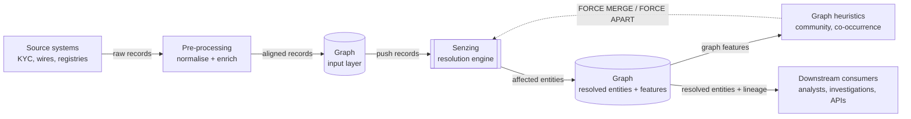

# Architecture — The Loop, End to End

## Narrative

The shape of the system matters more than any single component in it. We do not push data straight into Senzing and call it a day. The data lands in the graph first, the graph pushes records to Senzing, Senzing's output flows back into the graph as resolved entities, and the graph itself produces signals — communities, co-occurrence, paths — that we feed *back* to Senzing as reinforcement. That last edge is the part most ER architectures skip, and it is the part that turns a one-way pipeline into a system that gets sharper over time.

(Mermaid source mirrored in `assets/diagrams/04_architecture_loop.mmd`.)

### The transparent overlay

Between source systems and Senzing, we run what we call a **transparent overlay**. Concretely: a graph-resident layer — nodes and edges in our graph store, populated by our ingestion services — that sits *between* the source systems and Senzing. It mirrors the raw records, captures everything we know about them (provenance, source system, original strings, normalisation results, the dedup hash from Section 02), and emits graph elements derived from that knowledge. The records do not become Senzing's input until they have passed through this layer.

Physically, it is code we own and a portion of the graph schema we control. It is not a Senzing component, not a separate database, not a black-box service — it is the part of our system that captures everything we know about a record before resolution touches it.

"Transparent" means nothing is hidden from the people downstream. Every node we create, every edge we draw, every normalisation we applied, has its lineage attached. When an analyst asks "why does this record link to that entity?", we can show the chain — source → normalisation → push to Senzing → resolution decision — without reverse-engineering anything.

This overlay is what we own. Senzing is what we operate. The split matters: the overlay is bespoke per customer (their data, their sources, their consent rules), and the resolution engine is shared infrastructure.

## Speaker notes

- This is the diagram the audience should hold in their head for the rest of the workshop. Put it up early, name each box once, and refer back to it whenever a later section touches one of the arrows.
- The "transparent overlay" framing is ours — make sure the audience understands it is not Senzing terminology. Define it on first use and use it consistently.
- The reinforcement edge (the dotted arrow back into Senzing) is the thing we keep coming back to. Trail-blaze it here, even though the mechanics are not until Section 07.

## Assets

- `assets/diagrams/04_architecture_loop.mmd` — Mermaid diagram of the full loop, including the reinforcement edge from graph heuristics back to Senzing.

## Open questions

- Whether to show the reinforcement edge (FORCE MERGE / FORCE APART) here or save the mechanics for Section 07. Currently we mention it and defer the detail.
