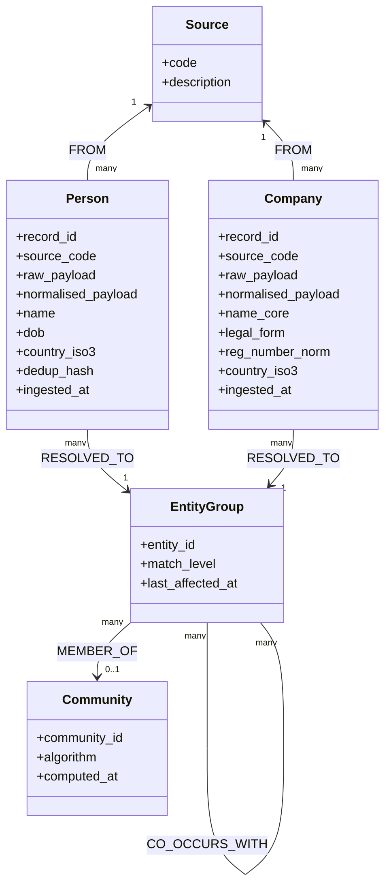

# Storing Resolved Entities — The Graph Model

## Narrative

Once Senzing tells us "these entities were affected", we have to land that information somewhere durable, queryable, and respectful of the constraints around it. The constraints are not optional decorations: in the world we operate in, a user's access to data is scoped by source (RBAC by source), and we cannot quietly mix data across sources into a fused-entity view that ignores those scopes. The model below is shaped around that reality; the next section (05b) is about the consequences.

### The core model

Four kinds of node, and the edges between them carry the work:

- **`Source`** — the system of origin (KYC, wires, registry feed). RBAC attaches here; users have access to a set of sources, and that set determines what they see in the rest of the graph.
- **Typed record nodes** — `Person`, `Company`, `Account`, and so on. Each source record becomes a node whose label is its type and whose properties are the record's payload (raw + normalised). A KYC person record is a `:Person` node; a registry company record is a `:Company` node. Records are immutable; updates are new records, not mutations.
- **`EntityGroup`** — the graph representation of what Senzing calls an *Entity*. We use `EntityGroup` as the label deliberately: it names the *grouping* concept (a join point for the records Senzing resolved together), and avoids overloading the word "entity" which is used colloquially throughout the workshop. An `EntityGroup` holds the Senzing `entity_id`, the last-affected timestamp, and the resolution metadata — **but not the consolidated record properties**. The properties live on the record nodes. The `EntityGroup` is the join.
- **`Community`** — the output of community detection on the co-occurrence graph. Derived, not from Senzing.

Edges:

- `(:Person|Company|...)-[:FROM]->(:Source)` — provenance, used everywhere.
- `(:Person|Company|...)-[:RESOLVED_TO]->(:EntityGroup)` — the link Senzing's output produces, with the `MATCH_LEVEL_CODE` and the `WHY` attached as edge properties.
- `(:EntityGroup)-[:RELATED_TO]->(:EntityGroup)` — Senzing's `POSSIBLY_RELATED` output, kept distinct from resolution.
- `(:EntityGroup)-[:CO_OCCURS_WITH]->(:EntityGroup)` — derived, not from Senzing: two `EntityGroup`s appear in the same transactions, share addresses, or sit on the same beneficial-ownership chains.
- `(:EntityGroup)-[:MEMBER_OF]->(:Community)` — output of community detection on the co-occurrence graph.

(Mermaid source mirrored in `assets/diagrams/05_graph_model.mmd`.)

## Speaker notes

- Walk the four node labels in order, then the five edge types. The audience needs the labels in their head before we get to RBAC in 05b.
- Naming: we use `EntityGroup` in the graph for what Senzing calls *Entity*. Flag this once explicitly to avoid confusion when Paco refers to "entities".
- This section ends on the diagram. The "single most important property of this model" line in 05b is the natural next breath — do not pause for questions between 05a and 05b, take them after both.

## Assets

- `assets/diagrams/05_graph_model.mmd` — class-style Mermaid diagram of the storage model with typed record nodes.

## Open questions

- Whether there is a legitimate need for a *separate* grouping concept (case files, investigations, snapshots) layered on top of `EntityGroup`. If yes, we would introduce a distinct node label (e.g. `Case`, `Investigation`) so we do not overload `EntityGroup`.
- Whether to make the model in this section fully Hume-flavoured, or keep it tool-agnostic. Christophe to decide.
